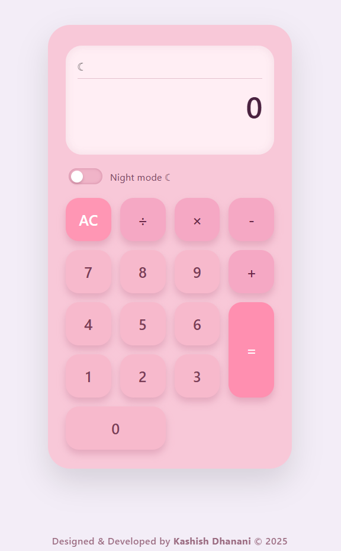
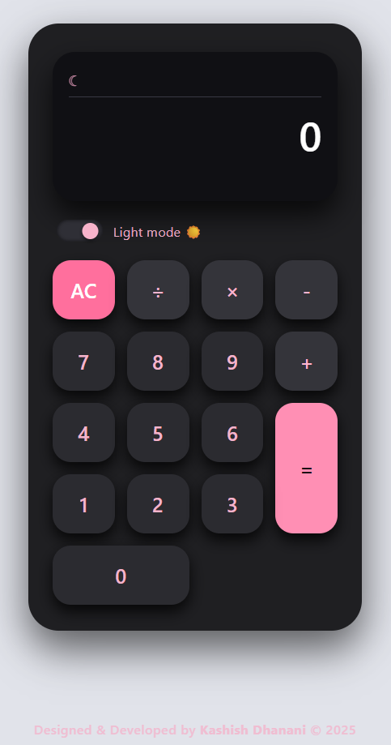

# 🌸 Pastel & Blackpink Calculator  
A modern, aesthetic calculator featuring a **pastel pink light mode**, a **blackpink-inspired dark mode**, smooth button animations, and a custom mechanical “tock” click sound generated using the Web Audio API.

Beautifully designed & developed by **Kashish Dhanani © 2025**.

---

## ✨ Features

- 🎀 **Dual Theme** — pastel light mode + blackpink dark mode  
- 🖤 **Toggle Switch UI** — animated theme switch inspired by modern mobile apps  
- 🎧 **Mechanical Tock Sound** — clean & subtle, built with Web Audio API  
- 🧮 **Fully Functional Calculator** — +, −, ×, ÷, AC, equals, expression preview  
- 📱 **Responsive Design** — works on desktop and mobile  
- 🌈 **Smooth UI/UX** — shadows, hover effects, tactile button feel  
- 💡 **Auto-Fitting Display** — result shrinks neatly for long numbers  
- 💻 **Clean Code** — readable HTML, CSS, JS structure  

---

## 📸 Screenshots

### 🌸 Light Mode


### 🖤 Dark Mode


---

## 🛠️ Tech Stack

- **HTML5** — structure  
- **CSS3** — modern UI, shadows, theming  
- **JavaScript (ES6)** — calculator logic, theme switch, sound engine  
- **Web Audio API** — tactile mechanical click sound  

---

## 🚀 Installation & Usage

Clone the repo:

```bash
git clone https://github.com/YOUR-USERNAME/YOUR-REPO.git
cd YOUR-REPO
Run locally using a simple Python server (recommended):

bash
Copy code
python -m http.server
Open in your browser:

arduino
Copy code
http://localhost:8000

That's it — your calculator is live!
